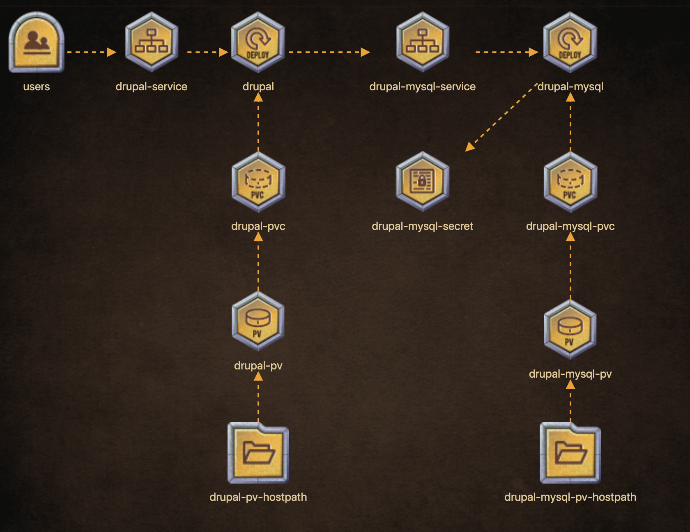

# Solution for Drupal with Mysql

# Table of Contents
- [Map](#map)
- [Deployment files](#deployment-files)

## Map

## Deployment Files
- [Drupal Mysql PV](./drupal-mysql-pv.yaml)
- [Drupal Mysql PVC](./drupal-mysql-pvc.yaml)
- Secret - `kubectl create secret generic drupal-mysql-secret --from-literal=MYSQL_ROOT_PASSWORD=root_password --from-literal=MYSQL_DATABASE=drupal-database --from-literal=MYSQL_USER=root`
- [Drupal Mysql Deployment](./drupal-mysql.yaml)
- [Drupal Mysql Service](./drupal-mysql-service.yaml)
- [Drupal PV](./drupal-pv.yaml)
- [Drupal PVC](./drupal-pvc.yaml)
- [Drupal Deployment](./drupal.yaml)
- [Drupal Service](./drupal-service.yaml)

