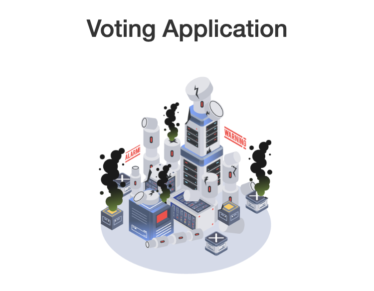
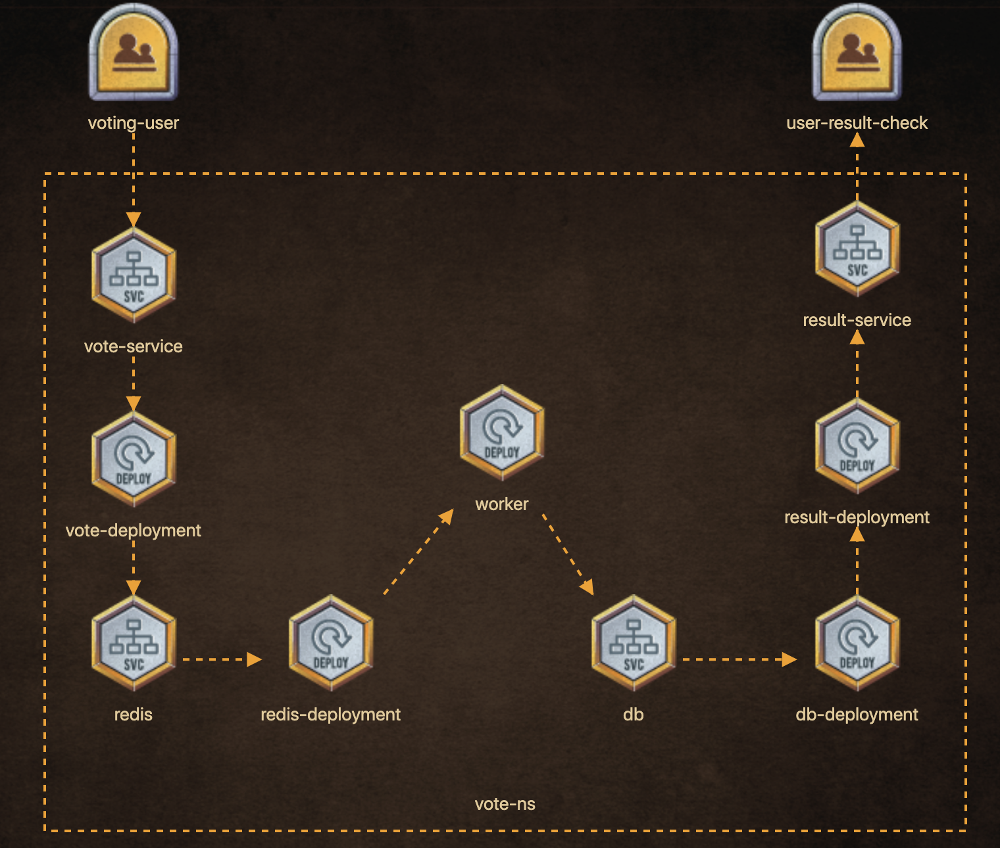

# Solution for Voting Application

# Table of Contents
- [Map](#map)
- [Namespace Creation](#namespace-creation)
- [Switch to Namespace](#switch-to-namespace)
- [Deployment files](#deployment-files)

## Map

## Namespace Creation
`kubectl create namespace vote`

## Switch to Namespace
`kubectl config set-context --current --namespace=vote`

## Deployment Files
- [Vote Deployment](vote-deployment.yml)
- [Vote Service](vote-service.yml)
- [Redis Deployment](redis-deployment.yml)
- [Redis Service](redis-service.yml)
- [Worker](worker.yml)
- [DB Deployment](db-deployment.yml)
- [DB Service](db-service.yml)
- [Result Deployment](result-deployment.yml)
- [Result Service](result-service.yml)
